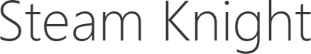
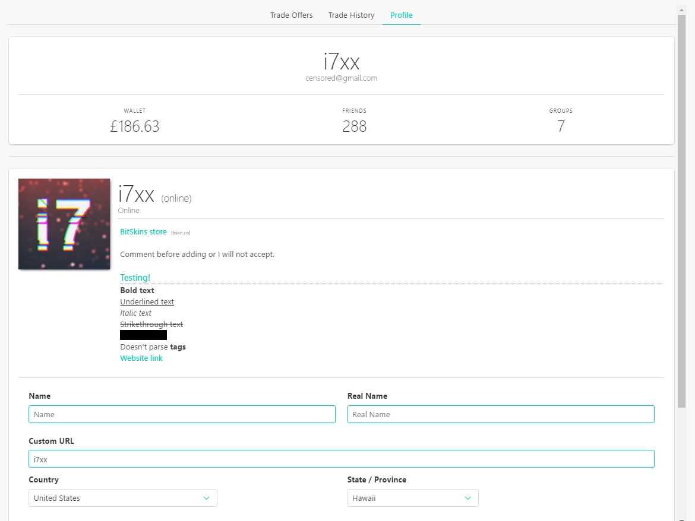
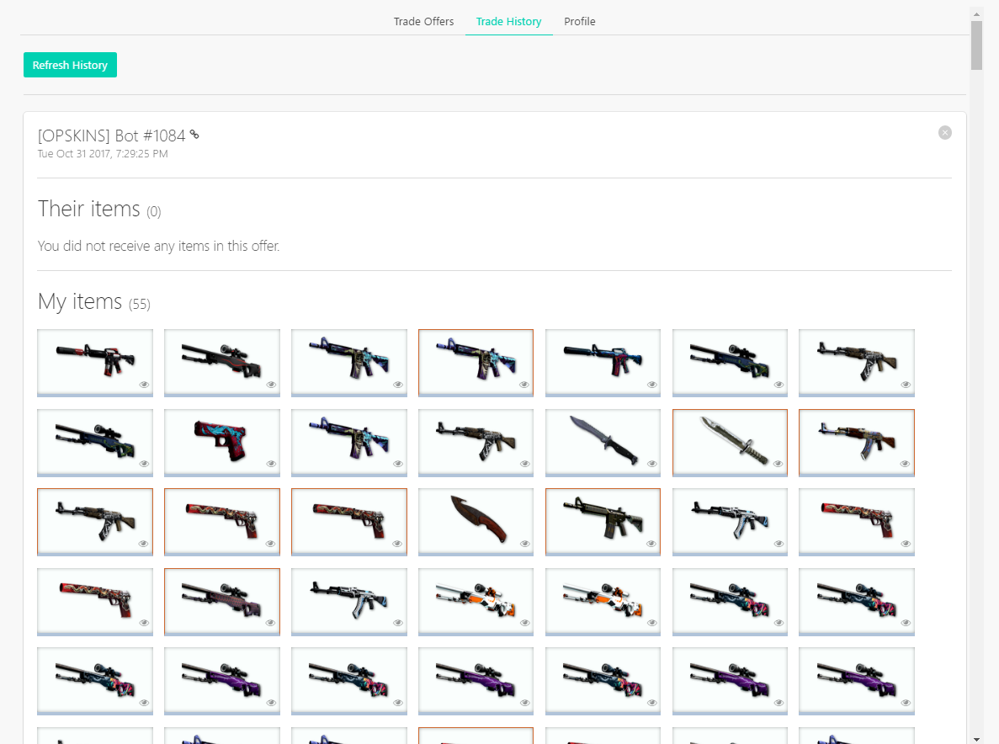
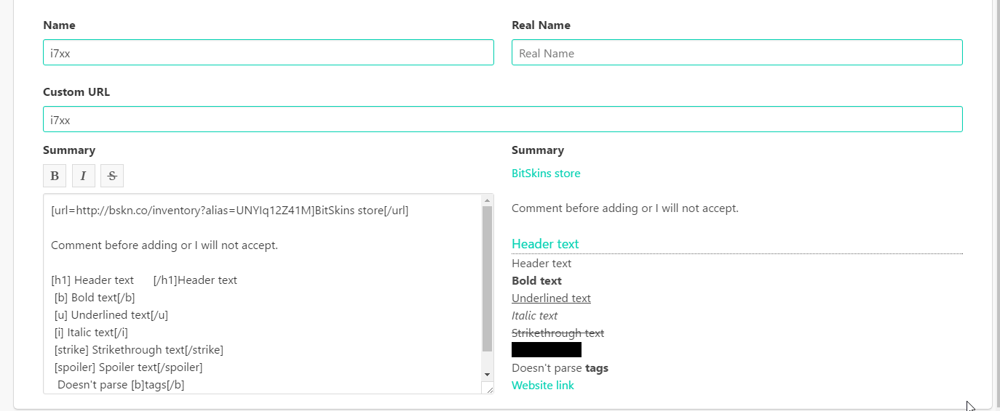

<h1 align="center">
	<br>
	
	<br>
	<br>
</h1>

> A Steam client built with VueJS and Electron.

---

## Features

### Encryption

Account details are protected using the PBKDF2 key derivative function
with 10,000 iterations and user generated passwords. Account details
are stored locally in an encrypted file and this encryption means only
users with the master password will be able to decrypt the credentials
and access your accounts.

Credentials and keys are stored to allow the client to automatically
log the accounts in to Steam.

### Trade Offers/History

The client will load all your currently active trade offers as well as
your trade offer history in a summarised form with inspect links and links
to the partner's profile.

Due to Steam limitations, the client is unable to provide a list of
trade offers or market listings awaiting confirmation.

### Profile

The client displays profile information such as friend count, group
count, wallet amount, as well as displaying your community profile
and allowing you to publish changes directly from the client.

### Screenshots

#### Profile
<!--  -->


#### Trades
<!--  -->


#### Bio


#### Demo


### TODO

- add prices to items
- add the ability to change the pricing source
- display friends list
- implement a fully function chat

---

#### Build Setup

``` bash
# install dependencies
npm install

# serve with hot reload at localhost:9080
npm run dev

# build electron application for production
npm run build

# lint all JS/Vue component files in `src/`
npm run lint
```